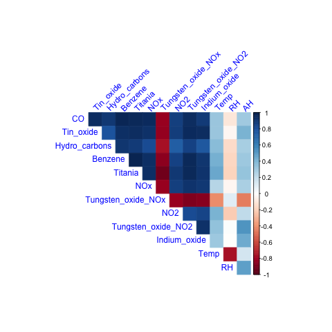
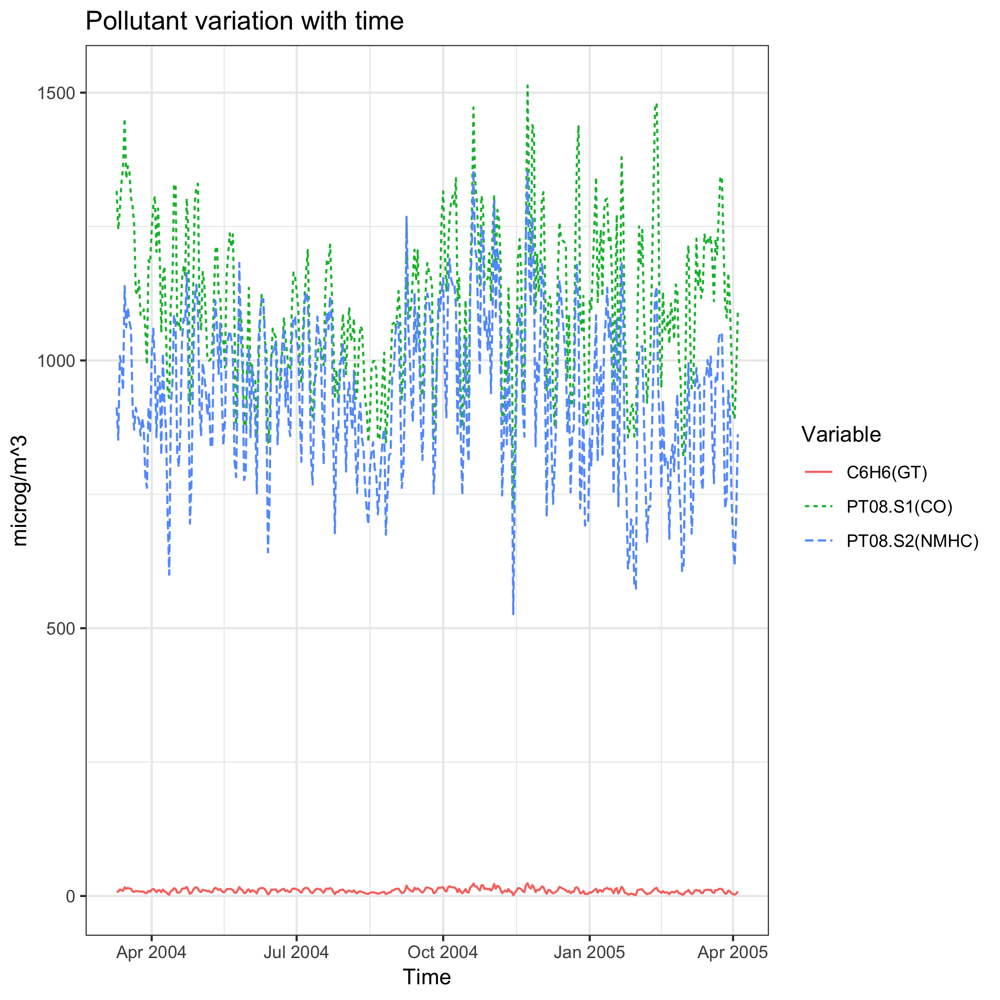
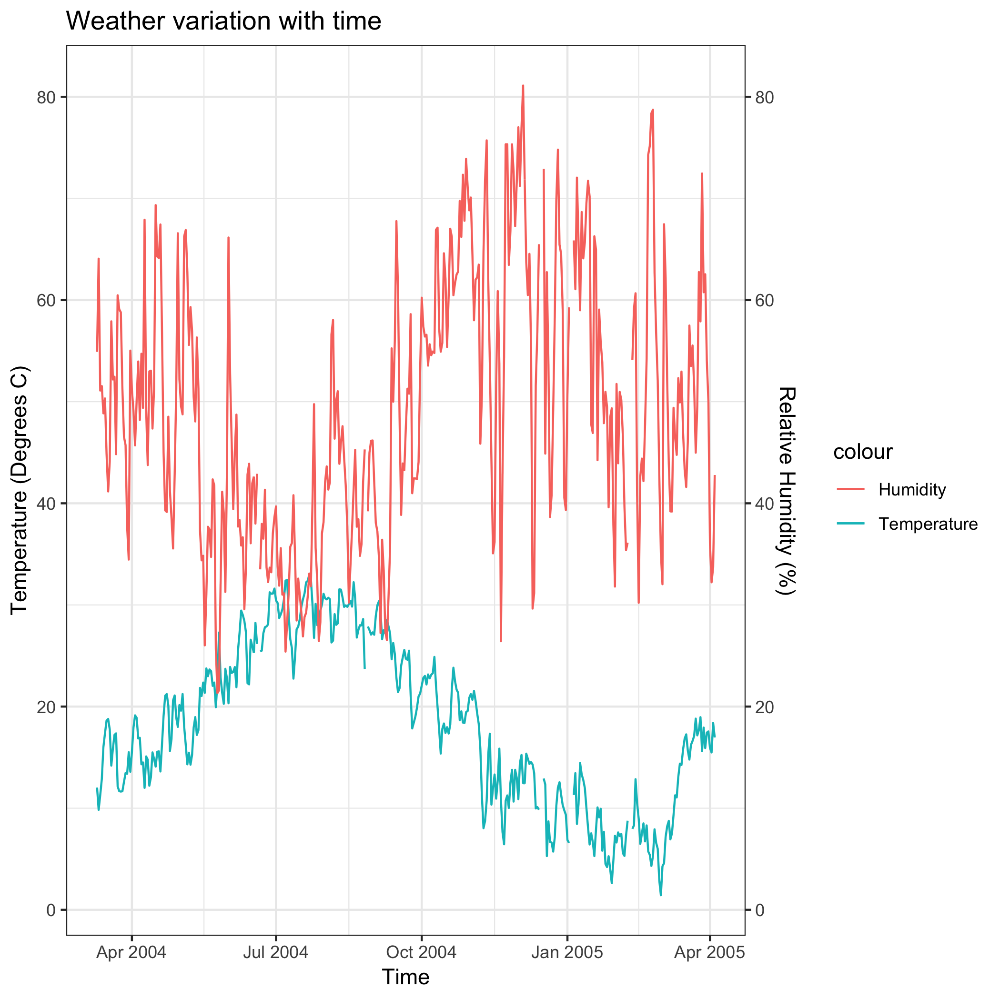
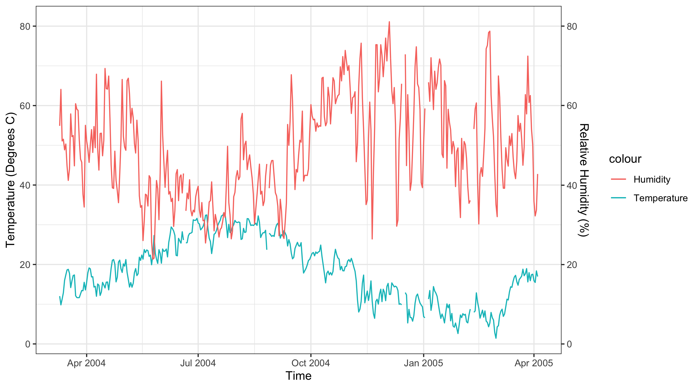

```{r libraries, echo= FALSE, warnings = FALSE, echo= FALSE, message=FALSE}
library(here)
library(tidyverse)
library(DT)
library(knitr)
library(lubridate) 
library(tidyquant)
library(corrplot)
library(cowplot)
```


# Air Quality Data

## Introduction

The adverse affects of air pollution on health are well documented and air pollution can lead to a large range of diseases and increased morbidity and mortality (Younger et al., 2008). Adverse health impacts include, but are not limited to, lung cancer risk, respiritory infections, allergic disease and asthma (Younger et al., 2008; Shea et al., 2008). These health risks can affect a large proportion of the population as many different groups are vulnerable to the effects of air pollution including infants, children, the elderly, people with impaired immune systems, and people who work or are physically active outdoors (Matooane et al., 2004).

Because of the many, and severe, impacts of air quality, it is important to understand patterns in the data. We have a dataset of air quality observations as well as temperature and humidity data which we will use to gain understanding of the patterns and impacts of weather on air quality. 


## Data Description

The air quality [dataset](https://archive.ics.uci.edu/ml/datasets/Air+Quality) used in this analysis was obtained from the University of California Irvine Machine learning Repository. It was contributed by Saverio De Vito from the National Agency for New Technologies, Energy and Sustainable Economic Development. 

The dataset contains 15 variables and 9358 observations of hourly averaged responses from an Air Quality Chemical Multisensor Device. Data were recorded from March 2004 to February 2005, in a significantly polluted area, at road level, within a city in Italy. Variables include the date and time each response was recorded, and the corresponding concentrations of 13 air pollutants analyzed by the sensor device. Missing values are tagged with -200 value. Below is the entire variable set: 

```{r echo = FALSE, results='asis'}
Variables = c("Date", "Time", "CO(GT)", "PT08.S1(CO)", "NMHC(GT)", 
              "C6H6(GT)","PT08.S2(NMHC)","NOx(GT)", "PT08.S3(NOx)", "NO2(GT)",
              "PT08.S4(NO2)", "PT08.S5(O3)", "T", "RH", "AH")
Type = c("character", "time", "double", "integer", "integer",
         "double", "integer", "integer","integer", "integer",
         "integer", "integer", "double","double","double")
Description = c("Date (DD/MM/YYYY)",
                "Time (HH.MM.SS)",
                "True hourly averaged concentration CO in mg/m^3 (reference analyzer)",
                "PT08.S1 (tin oxide) hourly averaged sensor response (nominally CO targeted)",
                "True hourly averaged overall Non Metanic HydroCarbons concentration in microg/m^3 (reference analyzer)",
                "True hourly averaged Benzene concentration in microg/m^3 (reference analyzer)",
                "PT08.S2 (titania) hourly averaged sensor response (nominally NMHC targeted)",
                "True hourly averaged NOx concentration in ppb (reference analyzer)",
                "PT08.S3 (tungsten oxide) hourly averaged sensor response (nominally NOx targeted)",
                "True hourly averaged NO2 concentration in microg/m^3 (reference analyzer)",
                "PT08.S4 (tungsten oxide) hourly averaged sensor response (nominally NO2 targeted)",
                "PT08.S5 (indium oxide) hourly averaged sensor response (nominally O3 targeted)",
                "Temperature in °C",
                "Relative Humidity (%)",
                "AH Absolute Humidity")
desc.tbl = data.frame(Variables, Type, Description)
kable(desc.tbl)
```


## Exploring the dataset

```{r read data, warnings = FALSE}
# first we read the data in
airq <- readr::read_csv(here::here("data","airquality.csv"))
DT::datatable(airq)
```

### Summary Statistics

The following shows the five-number stats summary for each variable:
```{r}
# Five-number summary for each variable
summary(airq)
```

The following shows some preliminary info on the air quality dataset that we are using. We record the number of total observations, number of missing observations, percentage of missing values and the number of usable observations. 

```{r summary stats}

# Look at missing values for each variable
missing = list()
for(i in 1:15) {
  l = length(which(airq[i] == -200))
  missing[[i]] = l
}
obs = list()
for(i in 1:15) {
  o = length(airq[[i]])
  obs[[i]] = o
}
dfmissing = data.frame(Variables, 
                       matrix(unlist(missing), nrow=length(missing), byrow=T),
                       matrix(unlist(obs), nrow=length(missing), byrow=T))
names(dfmissing)[names(dfmissing) == "matrix.unlist.missing...nrow...length.missing...byrow...T."] = "Count of Missing Values"
names(dfmissing)[names(dfmissing) == "matrix.unlist.obs...nrow...length.missing...byrow...T."] = "Total Observations"
dfmissing %>% 
  mutate(`% Missing Values` = `Count of Missing Values`/`Total Observations`*100) %>%
  mutate(`Usable Observations` = `Total Observations` - `Count of Missing Values`)

```

From this we see that for many of the observations less than 4% of the data is missing. This is adequate for the research we are conducting. 

### Graph 1: Correlogram of pollutants



Looking at the correlations of the pollutants with weather, we can see that for all pollutants except NOx, temperature (T) is positively correlated, although weakly so. This means that higher temperatures correspond to higher concentrations of the gases. Relative humidity (RH) is negatively and correlated to temperature and has a weak negative correlation to the concentrations of pollutants, except NOx. Absolute humidity (AH) has stronger correlations, mostly positive, although, like temperature, it has a negative correlation with NOx. 


### Graph 2: Concentration of some Air Pollutants, Temperature, Humidity over Time, daily average

The plot below shows the **daily** averaged concentrations of some of the pollutants (tin oxide, benzene, and Titania) for a year.




### Graph 3: Concentration Temperature and Humidity over Time

The plot below show the **daily** averaged values of temperature and humidity for a year.




### Graph 4: Temperature vs. Benzene concentration

The following graph shows the relationship of benzene to temperature over the year in which data was recorded. The plot suggests there is perhaps a slight relationship. Linear regression in future work will help to clarify the relationships between weather and pollutant concentrations. 




## Research question
In this analysis, we will attempt to determine the effects of temperature and humidity on the concentration of air pollutants so our research question is:

What is the affect of temperature and humidity on the concentration of air pollutants, such as benzene, titania, and tin oxide?

## Plan of action
With our research question, we are interested in the hourly averaged concentrations of air pollutants, temperature and humidity. We will ignore variables which have too many missing data to increase the precision of this analysis. The air pollutants that we will focus on are benzene, titania and tin oxide. After dealing with the missing data, we will perform a linear regression analysis using OLS (ordinary least square) method. Coefficients of relevant variables will be plotted with confidence intervals.

## References

S. De Vito, E. Massera, M. Piga, L. Martinotto, G. Di Francia, On field calibration of an electronic nose for benzene estimation in an urban pollution monitoring scenario, Sensors and Actuators B: Chemical, Volume 129, Issue 2, 22 February 2008, Pages 750-757, ISSN 0925-4005.

Matooane, M., John, J., Oosthuizen, R., and Binedell, M. 2004. Vulnerability of South African communities to air pollution. In: 8th World Congress on Environmental Health. Durban, South Africa: Document Transformation Technologies.

Shea, K., Truckner, R., Weber, R., and Peden, D. 2008. Climate change and allergic disease. Journal of Allergy and Clinical Immunology, 122(3): 443-453.  

Younger, M., Morrow-Almeida, H., Vindigni, S., and Dannenberg, A. 2008. The Built Environment, Climate Change, and Health Opportunities for Co-Benefits. American Journal of Preventative Medicine, 35 (5): 517-526.


